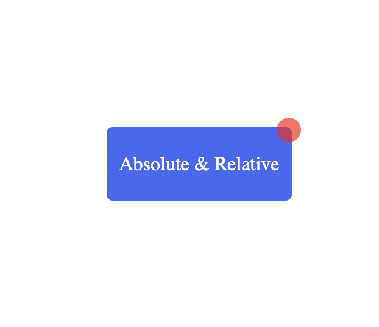

# Frontend Project 1: Absolute vs Relative

This project is part of my **Frontend Journey 🚀** where I'm learning core CSS concepts.

---

## 🌐 Live Demo
[Click Here](https://mrlayy.github.io/frontend-project-1-absolute-relative/)

---

## What I Learned
- The difference between **absolute** and **relative** positioning in CSS
- How **relative** affects child elements
- How **absolute** behaves inside **relative parent containers**
- Practical implementation of layout control

---

## Screenshot


---

## Tech Stack
- HTML
- CSS

---

## Folder Structure
```
📁 frontend-project-1-absolute-relative
├─ index.html
├─ style.css
└─ screenshot.png
```

---

## How to Run
1. Clone this repo:
```bash
git clone https://github.com/mrlayy/frontend-project-1-absolute-relative.git
```
2. Open `index.html` in your browser


### Follow My Journey:
[Frontend Journey Repo](https://github.com/mrlayy/frontend-journey)

